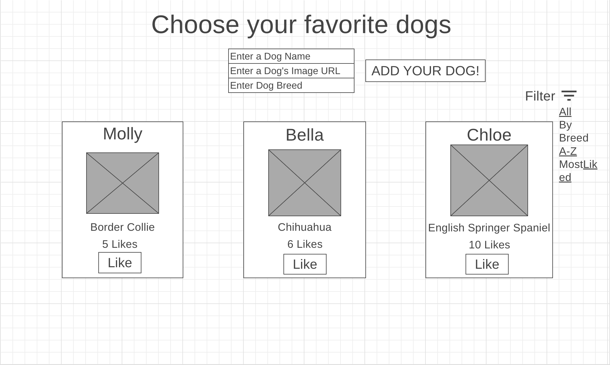

# Dog Liker Website

## Project: 
This website will allow the user to view, like, and add their own dog as well as filter dog profiles to find ones they're looking for. We'll be using a json server to pull information from and using buttons, filters, and submit form event listeners to create a dynamic page with interactivity.

## User Stories:
* As a user, I want to be able to see all the dogs in the database as soon as the page renders so that I can feel better about the bad day I'm having.
* As a user, I want to be able to see each dog's name, breed, and amount of likes each dog has gotten so that I know exactly which dog I'm looking at and which is the most popular.
* As a user, I want to be able to personally like whichever dog I want so that my likes get added into the database. 
* As a user, I want to be able to filter out which dogs I want to see either based on what breed, most popular, or even putting the dogs in alphabetical order so that I can see the dogs that I specifically want to see. 

## Wireframe:

